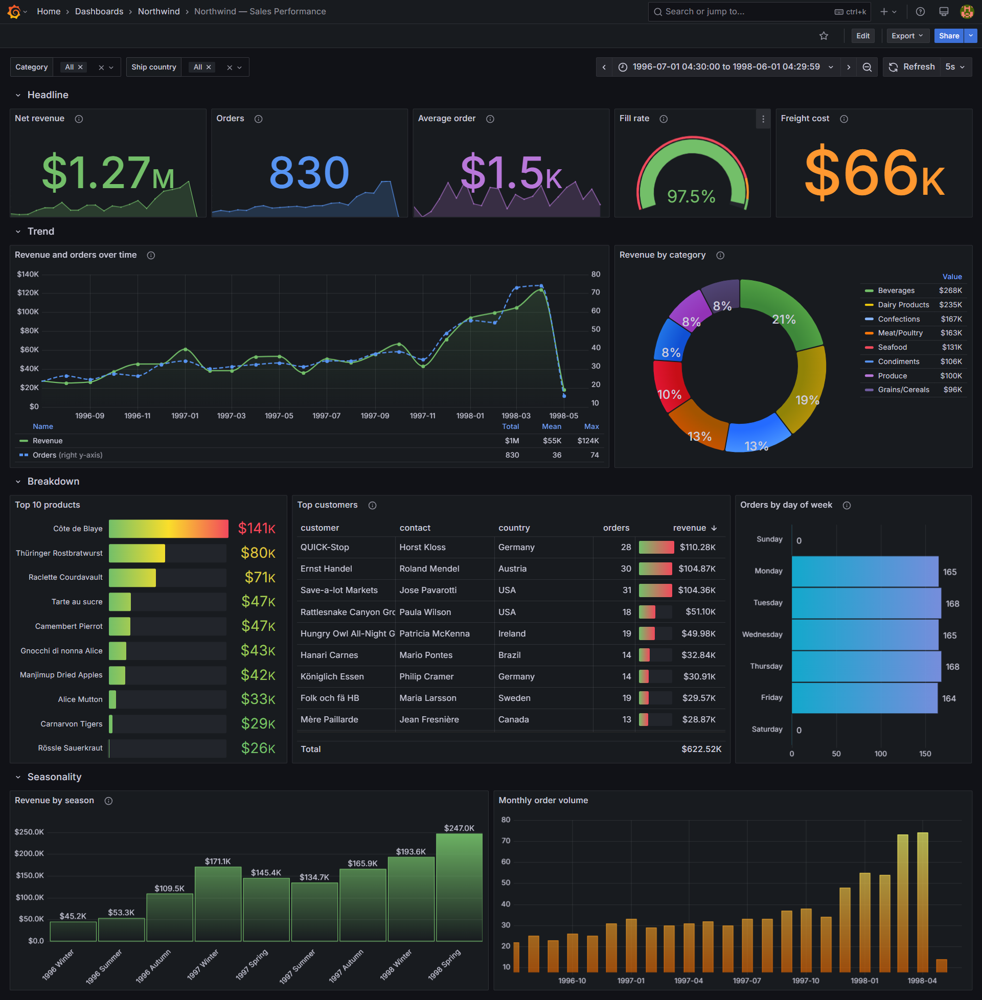
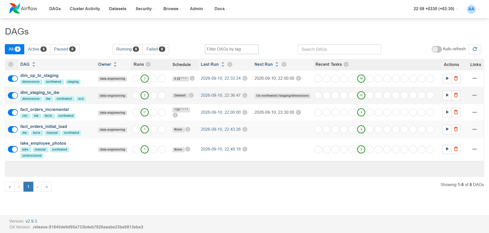
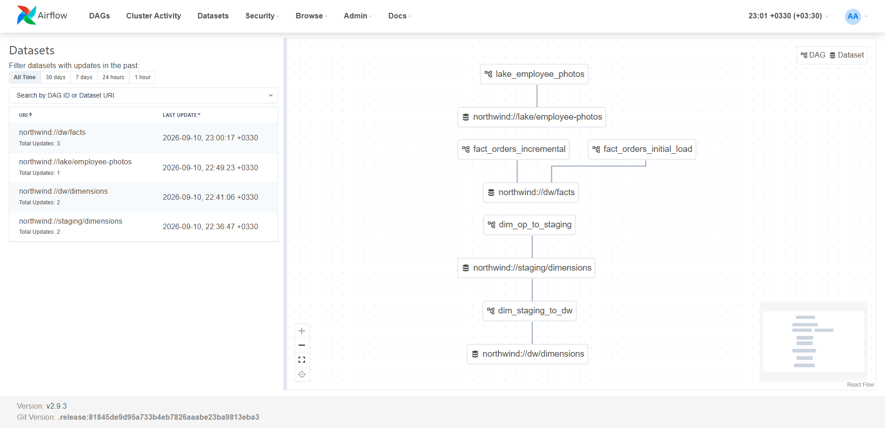
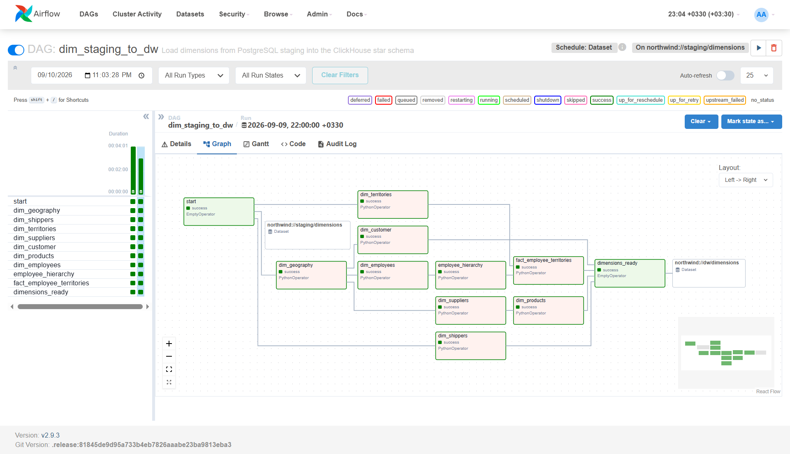
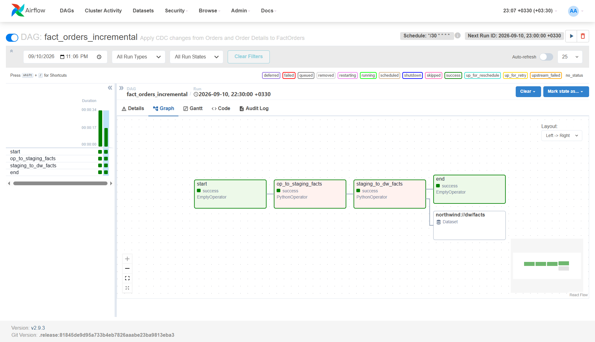
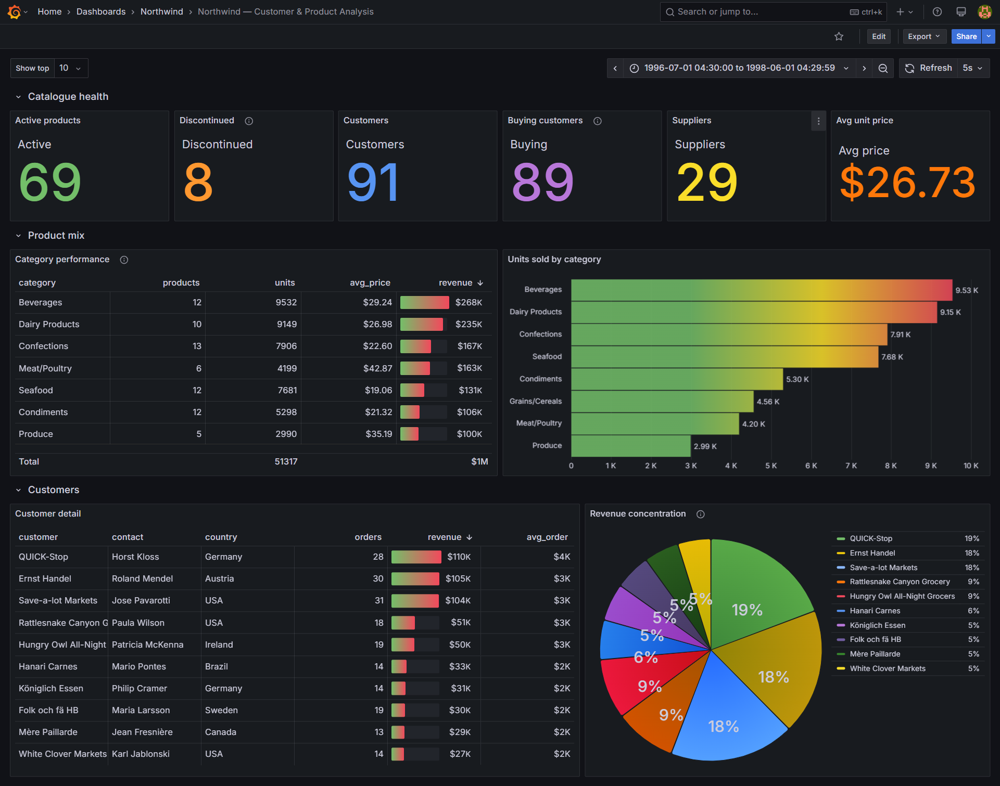
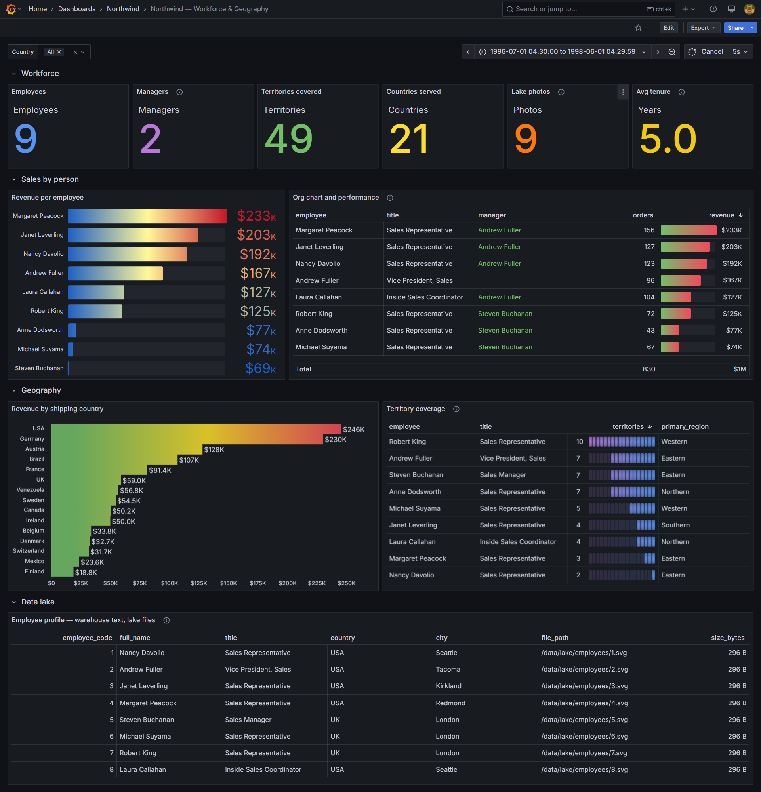

# Northwind Data Platform

Migrating a traditional Microsoft BI stack — SSIS packages and an SSAS
multidimensional model over the Northwind sample — to a container-based
data platform built on open-source components.

The reference implementation ran as SQL Server Agent jobs with an overnight
lag. This one keeps the same warehouse design and the same SCD semantics,
but replaces the orchestration with Airflow, the transformations with
PySpark, and the warehouse engine with ClickHouse.



---

## Contents

- [Architecture](#architecture)
- [Running it](#running-it)
- [What the pipeline does](#what-the-pipeline-does)
- [BI concepts implemented](#bi-concepts-implemented)
- [Design decisions worth reading](#design-decisions-worth-reading)
- [Dashboards](#dashboards)
- [Repository layout](#repository-layout)
- [Verification](#verification)
- [Troubleshooting](#troubleshooting)
- [Known deviations from the reference](#known-deviations-from-the-reference)

---

## Architecture

```
┌──────────────┐    ┌──────────────┐    ┌──────────────┐    ┌──────────┐
│  OP          │    │  Staging     │    │  DW          │    │ Grafana  │
│  SQL Server  │───▶│  PostgreSQL  │───▶│  ClickHouse  │───▶│          │
│              │    │              │    │              │    │          │
│  Northwind   │    │  16 tables   │    │  Star schema │    │ 4 boards │
│  ETL_Settings│    │  truncated   │    │  8 dims      │    │ 5s refresh│
│  CDC enabled │    │  every run   │    │  2 facts     │    │          │
└──────────────┘    └──────────────┘    └──────────────┘    └──────────┘
        │                   │                   │
        └───────────────────┴───────────────────┘
                    Apache Airflow
              PySpark inside PythonOperator

                    ┌──────────────┐
                    │  Data Lake   │
                    │  employee    │──── joined on employee_code
                    │  photographs │
                    └──────────────┘
```

Each layer runs in its own container, on its own engine, chosen for what
that layer actually does:

| Layer              | Engine          | Why                                                                |
| ------------------ | --------------- | ------------------------------------------------------------------ |
| **OP**             | SQL Server 2022 | The source system, and the only engine with first-class CDC        |
| **Staging**        | PostgreSQL 15   | Row store with a mature planner — joins and cleanup belong here    |
| **DW**             | ClickHouse      | Columnar, built for the scan-heavy queries a star schema attracts  |
| **Orchestration**  | Airflow 2.9     | DAGs, dataset-driven triggers, retry semantics                     |
| **Transformation** | PySpark 3.5     | Runs in-process inside the Python operator, as the brief specifies |
| **Presentation**   | Grafana 11.6    | Provisioned datasource and dashboards, no manual setup             |

---

## Running it

### Prerequisites

- Docker Engine 20.10+ with Compose v2
- 16 GB RAM (the stack reserves roughly 10 GB)
- On Windows: WSL2, with the project inside the Linux filesystem rather
  than under `/mnt/c` — the difference in I/O speed is an order of magnitude

### First run

```bash
git clone https://github.com/H-Ghaffari/northwind-data-platform.git
cd northwind-data-platform

cp .env.example .env
echo "AIRFLOW_UID=$(id -u)" >> .env      # Linux and WSL only

docker compose up -d
```

Wait for every service to report healthy — SQL Server takes the longest:

```bash
docker compose ps
```

Then build the schemas and load the source data:

```bash
./scripts/setup_all.sh
```

This creates the Northwind and ETL_Settings databases, loads the sample
data, builds the staging and warehouse schemas, generates DimDate, and
enables CDC on the two fact source tables. It is idempotent — rerunning it
after a partial failure picks up where it left off.

### Loading the warehouse

Open Airflow at <http://localhost:28080> (`admin` / `admin`) and trigger,
in order:

| #   | DAG                        | What it does                                           |
| --- | -------------------------- | ------------------------------------------------------ |
| 1   | `dim_op_to_staging`        | Loads eight dimension sources into staging             |
| 2   | —                          | `dim_staging_to_dw` fires automatically on the dataset |
| 3   | `fact_orders_initial_load` | Seeds FactOrders with all 2,155 rows                   |
| 4   | `lake_employee_photos`     | Generates and catalogues the lake files                |

Then unpause `fact_orders_incremental`, which picks up CDC changes every
thirty minutes from that point on.

### Where things are

| Service    | URL                           | Credentials                    |
| ---------- | ----------------------------- | ------------------------------ |
| Airflow    | <http://localhost:28080>      | `admin` / `admin`              |
| Grafana    | <http://localhost:23000>      | `admin` / `admin`              |
| ClickHouse | <http://localhost:28123/play> | `dw_admin` / `dw123456`        |
| SQL Server | `localhost,21433`             | `sa` / `Northwind@2026`        |
| PostgreSQL | `localhost:25432`             | `staging_admin` / `staging123` |

Connecting from SSMS on Windows: use a **comma** before the port
(`localhost,21433`, not a colon) and tick **Trust server certificate**.

---

## What the pipeline does

### Five DAGs



| DAG                        | Schedule       | Purpose                                       |
| -------------------------- | -------------- | --------------------------------------------- |
| `dim_op_to_staging`        | `0 22 * * *`   | Full reload of dimension sources into staging |
| `dim_staging_to_dw`        | on dataset     | Applies SCD rules, assigns surrogate keys     |
| `fact_orders_initial_load` | manual         | One-off seed of FactOrders                    |
| `fact_orders_incremental`  | `*/30 * * * *` | Applies the CDC window                        |
| `lake_employee_photos`     | manual         | Generates and catalogues lake files           |

The 22:00 dimension window and the 30-minute fact cadence both come
directly from the project brief.

### Dataset-driven chaining



`dim_staging_to_dw` does not run on a clock. It subscribes to a dataset the
staging DAG emits when all eight sources have landed:

```python
staging_ready = EmptyOperator(
    task_id="staging_ready",
    outlets=[STAGING_DIMENSIONS],
)
```

Running the warehouse load at 22:30 because staging starts at 22:00 works
right up until staging takes 35 minutes — at which point the warehouse
quietly builds itself from half-filled tables. The dataset removes the
assumption.

The outlet sits on a separate terminal task rather than on each loader. On
the loaders it would fire when the _first_ source finished, not the last.

### Dimension load order is not cosmetic



```
geography   →  suppliers  →  products
            →  customer
            →  employees  →  employee_hierarchy
shippers, territories                    ↘
                                    fact_employee_territories
```

Every edge exists because the downstream task resolves a surrogate key the
upstream task creates. Getting it wrong does not fail loudly — the lookup
returns nothing and rows land with key 0, which looks like a data problem
rather than an ordering one.

### Facts load in two stages



```
op_to_staging_facts   reads CDC, snapshots affected orders, lands six tables
staging_to_dw_facts   resolves keys, applies to the warehouse, moves watermark
```

This mirrors the split between packages 11/12 and package 13 in the
reference SSIS project, and it earns its keep when the second half fails:
everything CDC reported is already in staging, so the retry resolves keys
again without going back to the source — and the watermark has not moved,
so nothing is lost either way.

---

## BI concepts implemented

### Star schema

Eight dimensions and two facts, matching the SSAS data source view from the
reference project:

**Dimensions** — `DimDate`, `DimGeography`, `DimProducts`, `DimSuppliers`,
`DimCustomer`, `DimEmployees`, `DimShippers`, `DimTerritories`

**Facts** — `FactOrders` (grain: order × product), `FactEmployeeTerritories`
(factless — records that a relationship exists, with no measure)

Two snowflake branches were deliberately flattened during staging:
`Categories` folds into `DimProducts` as `category_name`, and `Region` folds
into `DimTerritories` as `region_description`. Neither exists as a dimension
in the warehouse.

### Slowly changing dimensions

The type 1 / type 2 split for each dimension was extracted from the SSIS
packages themselves — specifically from which columns appear in each
package's two UPDATE statements:

| Dimension        | Type 1 (overwrite)                    | Type 2 (version)                        |
| ---------------- | ------------------------------------- | --------------------------------------- |
| `DimProducts`    | name, quantity per unit, stock levels | price, category, discontinued, supplier |
| `DimCustomer`    | company, title, phone, fax            | contact name, geography                 |
| `DimEmployees`   | names, birth date, hire date, phones  | title, geography, reports-to, notes     |
| `DimSuppliers`   | company, phone, fax                   | contact name, contact title, geography  |
| `DimTerritories` | territory description                 | region description                      |
| `DimShippers`    | everything — no history columns exist | —                                       |

The logic behind each split is consistent: a correction overwrites, a real
change gets a version. A misspelled name is a correction. A territory moving
to another region is an event worth keeping.

### Change data capture

CDC is enabled on `Orders` and `Order Details`, with capture instances named
`dbo_Orders` and `dbo_OrderDetails`. Every CDC function keys on the capture
instance rather than the table, which is why `ETL_Settings.CDC_State` is
seeded with those names.

The watermark advances **only after** the warehouse write succeeds:

```
read window → land in staging → apply to DW → advance watermark
```

A run that dies partway leaves the watermark where it was, so the next run
reprocesses the same window rather than skipping it. Reprocessing is
harmless — the fact table deduplicates on `(order_id, product_key)` — while
skipping would lose data silently.

### Inferred members

Dimensions reload nightly; facts reload every half hour. In the gap, a fact
can arrive referring to a customer the warehouse has never seen.

Dropping it would lose a real order. Failing would stop the pipeline over a
routine race. So the fact load creates a stub instead: a dimension row
carrying only its alternate key, with every other attribute at its zero
value. The next dimension load matches it on alternate key and fills in the
rest.

Stubs remain auditable afterwards:

```sql
SELECT * FROM DimCustomer FINAL WHERE company_name = ''
```

The pipeline health dashboard counts them, because a number that keeps
climbing means the dimension load is not keeping up — and someone will
eventually notice blank labels on a chart.

### Self-referencing dimension

`DimEmployees.parent_employee_key` holds the _surrogate_ key of the manager,
which cannot be resolved while the manager's own row may not exist yet. The
load runs in two passes: insert everyone, then resolve the hierarchy.

Andrew Fuller is the root and keeps `parent_employee_key = 0`.

### Lakehouse

Employee photographs live on disk under `data/lake/employees/`; only the
path, size and checksum go into ClickHouse. The join key is the employee
code, exactly as the brief describes:

```sql
SELECT employee_code, full_name, title, country, file_path
FROM v_EmployeeProfile
```

The image bytes are deliberately not stored in a column. A columnar store is
built for scanning many small values, and blobs would bloat every part while
slowing reads that have nothing to do with photographs.

Northwind ships with an empty `Photo` column, so the avatars are generated
deterministically — regenerating produces byte-identical files, keeping the
catalogued checksums valid.

---

## Design decisions worth reading

### ReplacingMergeTree, and why every write is an insert

ClickHouse makes `UPDATE` expensive — a mutation rewrites whole parts. So
none of the three SCD outcomes is expressed as an update:

| Outcome       | Implementation                                                      |
| ------------- | ------------------------------------------------------------------- |
| New row       | Insert with a fresh surrogate key                                   |
| Type 1 change | Insert over the same key with a higher `_version`                   |
| Type 2 change | Reinsert the old row with `end_date` set, then insert a new version |
| Delete        | Insert with `is_deleted = 1` — a tombstone                          |

`ReplacingMergeTree(_version)` resolves the result during background merges.
Without an explicit `_version` column, ClickHouse picks a survivor
arbitrarily, which in a warehouse means the older row sometimes wins.

### FINAL, and why reporting reads views

ClickHouse enforces no uniqueness. Duplicates sit on disk until a merge
runs, so a plain count can be wrong for minutes at a time:

```sql
SELECT count() FROM DimProducts;         -- 79, including unmerged rows
SELECT count() FROM DimProducts FINAL;   -- 78, history included
SELECT count() FROM v_DimProducts_Current;  -- 77, the actual answer
```

Every dimension has a `v_*_Current` view wrapping `FINAL` and the open-row
predicate, so a downstream query cannot forget either. Dashboards read the
views exclusively.

### Sentinel dates instead of NULL

`end_date` uses `2106-01-01` rather than NULL. Two reasons: a `Nullable`
column in ClickHouse costs an extra stored column, and range predicates stay
simple:

```sql
-- with NULL
WHERE start_date <= ? AND (end_date IS NULL OR end_date > ?)

-- with a sentinel
WHERE ? BETWEEN start_date AND end_date
```

The value is 2106 and not 9999 because ClickHouse `DateTime` is a 32-bit
second count that tops out there. Birth and hire dates use `Date32`, whose
range starts in 1900 — Northwind's employees were born between 1937 and
1966, all of which predate `DateTime`'s 1970 floor.

### Nulls are normalised once, at the staging boundary

Region is null on 87 of the 135 geography rows. Since `NULL = NULL` is not
true in SQL, joining on the address tuple would silently drop those rows
from every lookup.

Handling this downstream means each consumer has to remember, and the one
that forgets reports a change on every run. So every nullable string is
coalesced to `''` in the staging query and nowhere else.

Dates and `reports_to` stay nullable: an unknown birth date is not
1900-01-01, and a null `reports_to` means the root of the hierarchy — which
is information, not a gap.

### The fan trap on a master/detail fact

`FactOrders` has the grain of `Order Details`, so parent attributes repeat
across every line of an order:

| order_id | product             | line_total | freight          |
| -------- | ------------------- | ---------- | ---------------- |
| 10248    | Queso Cabrales      | 168.00     | 32.38            |
| 10248    | Singaporean Noodles | 98.00      | 32.38 ← repeated |
| 10248    | Mozzarella          | 174.00     | 32.38 ← repeated |

```sql
-- correct
SELECT sum(line_total) FROM v_FactOrders_Current;

-- wrong — triples the freight
SELECT sum(freight) FROM v_FactOrders_Current;

-- correct
SELECT sum(freight) FROM (SELECT DISTINCT order_id, freight FROM v_FactOrders_Current);
```

Every dashboard panel that touches freight deduplicates first.

### The incremental snapshot is scoped

The fact staging step snapshots only the orders the CDC window touched, not
the whole table. Copying all 830 orders every thirty minutes would make an
incremental schedule perform a full extract, at a cost growing with the
table rather than the change rate.

The snapshot exists because change tables carry only one side of the join: a
changed freight value puts a row in `staging_orders_update` and nothing in
the detail tables, yet every line of that order needs rewriting.

### Smart keys on the date dimension

`DimDate.date_key` is an integer in `yyyyMMdd` form, so facts derive it
directly:

```sql
toYYYYMMDD(order_date) AS order_date_key
```

`FactOrders` carries three date keys. Without this, each would need its own
join against DimDate. This is the one place in the model where a surrogate
key is derived rather than assigned — an accepted exception, since a date
never changes.

### DDL lives in scripts, not DAGs

Schema creation is run-once infrastructure, not a scheduled pipeline. A DAG
that creates databases is a scheduler with permission to drop them, and it
would need `sqlcmd` and `psql` inside the Airflow image for work the shell
scripts already do correctly from the database containers themselves.

`setup_all.sh` runs the five setup scripts in dependency order, so bringing
the platform up is still one command.

### Observability

Airflow records whether a task succeeded. It does not record what the data
did. `ETL_Settings.ETL_Log` fills that gap — one row per task execution,
written by success and failure callbacks:

```sql
SELECT dag_id, task_id, rows_written, status, finished_at
FROM ETL_Log ORDER BY log_id DESC;
```

Logging failures are swallowed deliberately: a pipeline that dies because
its logging table is unreachable has made observability worse, not better.

---

## Dashboards

Four boards, dark theme, 5-second refresh as the brief specifies.

### Sales Performance


Revenue, orders, average order value, fill rate and freight, with category
and country filters. Collapsed row for seasonality.

### Customer & Product Analysis



Catalogue health, category performance with in-cell gauges, revenue
concentration, and a top-N variable driving the customer table.

### Workforce & Geography



The org chart reconstructed from `parent_employee_key`, revenue per
employee, territory coverage from the factless fact table, and a collapsed
row showing the lakehouse join.

---

## Repository layout

```
├── docker-compose.yml          Seven services, memory-limited
├── .env.example                Credentials and ports — copy to .env
│
├── docker/
│   ├── airflow/                Airflow + JDK 17 + PySpark + JDBC drivers
│   ├── grafana/                Grafana with the ClickHouse plugin vendored
│   └── sqlserver/backup/       Mount point for .bak restores
│
├── sql/
│   ├── 01_op/                  Northwind schema, CDC enablement
│   ├── 02_staging/             16 staging tables
│   ├── 03_dw/                  Star schema and lake catalogue
│   └── 04_etl_settings/        CDC_State and ETL_Log
│
├── airflow/dags/
│   ├── dag_common/             Dataset definitions, ETL_Log callbacks
│   ├── dim_op_to_staging_dag.py
│   ├── dim_staging_to_dw_dag.py
│   ├── fact_orders_initial_dag.py
│   ├── fact_orders_incremental_dag.py
│   └── lake_employee_photos_dag.py
│
├── spark/jobs/
│   ├── common/                 Config, Spark helpers, SCD engine, CDC reader
│   ├── dimensions/             DimDate generator
│   ├── staging/                OP → Staging, dimensions and facts
│   ├── dw/                     Staging → DW, dimensions and facts
│   └── lake/                   Avatar generation and cataloguing
│
├── grafana/
│   ├── provisioning/           Datasource and dashboard providers
│   └── dashboards/             Four dashboards as JSON
│
├── scripts/                    setup_all.sh and the five it calls
├── data/lake/employees/        Generated files — git-ignored
└── docs/
    ├── dw-schema.md            Target schema, extracted from the SSAS DSV
    └── images/
```

The `dag_common` package is named that way rather than `common` because
`spark/jobs/common` already exists. With both on `sys.path`, Python would
resolve one and break the other.

Job modules are imported _inside_ task callables, not at module level.
Airflow reparses every DAG file on a short interval, and pulling PySpark
into that path costs seconds on every scheduler loop.

---

## Verification

Expected row counts for an unmodified Northwind:

```bash
docker compose exec northwind_dw clickhouse-client \
  --user dw_admin --password dw123456 --query "
SELECT 'DimDate' AS t, count() FROM NorthwindDW.DimDate
UNION ALL SELECT 'DimGeography',   count() FROM NorthwindDW.DimGeography
UNION ALL SELECT 'DimShippers',    count() FROM NorthwindDW.DimShippers
UNION ALL SELECT 'DimTerritories', count() FROM NorthwindDW.v_DimTerritories_Current
UNION ALL SELECT 'DimSuppliers',   count() FROM NorthwindDW.v_DimSuppliers_Current
UNION ALL SELECT 'DimCustomer',    count() FROM NorthwindDW.v_DimCustomer_Current
UNION ALL SELECT 'DimProducts',    count() FROM NorthwindDW.v_DimProducts_Current
UNION ALL SELECT 'DimEmployees',   count() FROM NorthwindDW.v_DimEmployees_Current
UNION ALL SELECT 'FactEmpTerr',    count() FROM NorthwindDW.FactEmployeeTerritories
UNION ALL SELECT 'FactOrders',     count() FROM NorthwindDW.v_FactOrders_Current
UNION ALL SELECT 'LakePhotos',     count() FROM NorthwindDW.LakeEmployeePhotos
ORDER BY 1 FORMAT PrettyCompact"
```

| Table                   | Rows   |
| ----------------------- | ------ |
| DimDate                 | 16,801 |
| DimGeography            | 135    |
| DimShippers             | 3      |
| DimTerritories          | 53     |
| DimSuppliers            | 29     |
| DimCustomer             | 91     |
| DimProducts             | 77     |
| DimEmployees            | 9      |
| FactEmployeeTerritories | 49     |
| FactOrders              | 2,155  |
| LakeEmployeePhotos      | 9      |

Total net revenue should be **$1,265,793.04** across **830** orders.

### Watching SCD work

Change a price at the source, rerun the dimension DAGs, and the old version
closes rather than disappearing:

```bash
docker compose exec -T northwind_op /opt/mssql-tools18/bin/sqlcmd \
  -S localhost -U sa -P 'Northwind@2026' -C -d Northwind \
  -Q "UPDATE Products SET UnitPrice = 25.00 WHERE ProductID = 1"
```

```sql
SELECT product_key, product_alternate_key, unit_price, start_date, end_date
FROM NorthwindDW.DimProducts FINAL
WHERE product_alternate_key = 1 ORDER BY start_date;
```

Two rows: the original with `end_date` set, and a new version with a fresh
surrogate key. Facts loaded before the change still point at the old key,
so historical figures stay correct.

---

## Troubleshooting

### Grafana restarts in a loop

The ClickHouse datasource plugin is served from a CDN that refuses requests
from some regions, and Grafana treats a failed plugin install as fatal — the
container exits, restarts, fails again.

This repository vendors the plugin archive at
`docker/grafana/plugins/clickhouse-datasource.zip` and unpacks it at build
time, so the image starts identically anywhere, including offline. The
archive is around 75 MB because it ships binaries for every platform; only
`linux_amd64` is used, and it could be trimmed if repository size mattered.

A proxy also fixes the download, but only for whoever has the proxy — not
for anyone cloning the repository, which is why the plugin is vendored
instead.

### Cannot connect to SQL Server from SSMS

Use a comma before the port: `localhost,21433`. Tick **Trust server
certificate**.

If Docker runs natively inside WSL rather than through Docker Desktop, ports
are not forwarded to the Windows loopback. Either connect to the WSL address
(`hostname -I`), or add port proxies with `netsh interface portproxy`.

### CDC captures nothing

CDC needs SQL Server Agent. `MSSQL_AGENT_ENABLED` is set in the compose
file, but if the container predates that setting, recreate it:

```bash
docker compose up -d --force-recreate northwind_op
```

Enabled-but-never-captured is the failure worth watching for: it produces no
error and no rows, which is indistinguishable from a quiet period unless
checked explicitly. `setup_cdc.sh` proves capture end to end by making a real
change and reading it back — a no-op update would be optimised away before
reaching the log and would report a false failure.

### A dimension rewrites rows on every run

Something is being compared as `None` against a stored `''`. Check the
staging query coalesces every nullable string; `write_to_dw` substitutes
zero values at insert, which is too late for the comparison.

---

## Known deviations from the reference

Three places where this implementation departs from the SSIS packages, each
deliberate:

**Geography lookup joins on five columns, not four.** The reference matches
on country, region, city and postcode, ignoring the street. `DimGeography`
stores the street, so a four-column match can return any of several rows for
the same city and postcode — SSIS silently takes the first. Including the
address makes the match exact.

**Deletes are tombstones, not DELETE statements.** The reference issues
`DELETE FROM FactOrders`. ClickHouse mutations rewrite whole partitions, so
an insert carrying `is_deleted = 1` costs a fraction of the same effect —
and keeps the deletion auditable.

**Employee photographs live in the lake, not in a column.** The reference
schema has a `Photo` image column on `DimEmployees`. The brief asks for the
photographs to sit outside the database and join back on employee code,
which is what this implementation does.

---

## Reference material

The target schema in `docs/dw-schema.md` was reverse-engineered from the
professor's `NorthwindDW_DSV.dsv` (the SSAS data source view, which stores a
complete copy of the warehouse schema as XML) and from the SQL embedded in
the fourteen `.dtsx` packages. Those packages are the authority for SCD type
assignments, load order and the inferred-member pattern; every deviation
from them is listed above.

---

## Acknowledgements

This project was completed as the final assignment for the Data Engineering
course at [Sematec](https://www.linkedin.com/company/sematec/), under the
instruction of [Vahid Ghorbani](https://www.linkedin.com/in/vahidghorbani/).

The warehouse design, the SSIS reference implementation and the
specification this platform was built against are all his work. What made
the project possible, though, was less the material than the way it was
taught.

My sincere thanks to Mr Ghorbani for his teaching, his patience with
questions, and his guidance throughout the course.

---

Built by [H-Ghaffari](https://www.linkedin.com/in/hoda-ghaffari-1891b156/).
